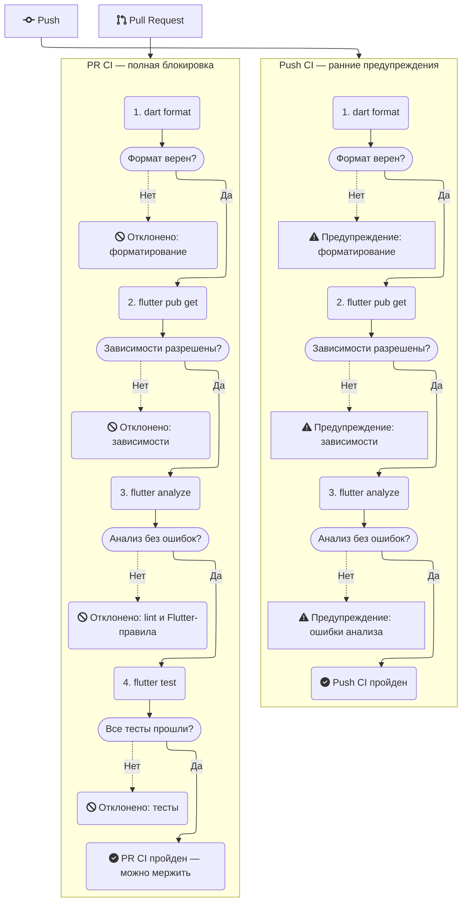

# CI Workflow Logic

## Описание

### Push CI

**Цель** — раннее выявление проблем в коде до того, как они станут критичными.

Процесс включает:

1. Проверку форматирования (`dart format`),
2. Разрешение зависимостей (`flutter pub get`),
3. Статический анализ (`flutter analyze`).

**Результат**: Предупреждения, но не блокировка.

### PR CI

**Цель** — строгий контроль качества перед слиянием изменений.

Процесс включает:

1. Проверку форматирования (`dart format`),
2. Разрешение зависимостей (`flutter pub get`),
3. Статический анализ (`flutter analyze`),
4. Запуск тестов (`flutter test`).

**Результат**: Блокировка при ошибках.

## GitHub Actions

В репозитории настроены два рабочих процесса:

- Push CI: запускается при каждом коммите в любую ветку.
- PR CI: запускается при создании или обновлении Pull Request.

Подробности — в файлах `.github/workflows/`.
